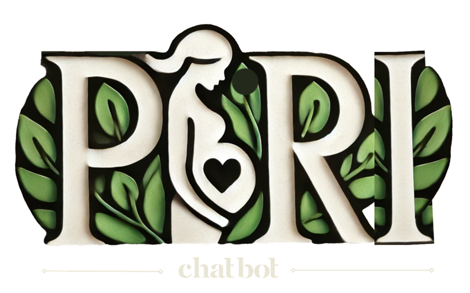
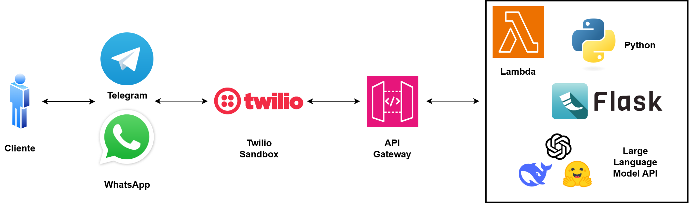
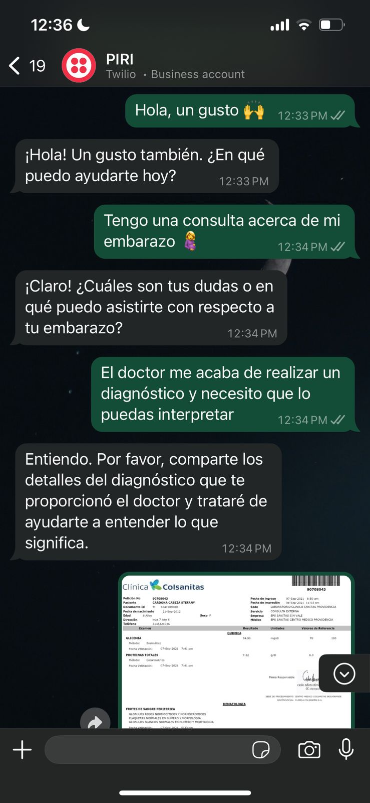
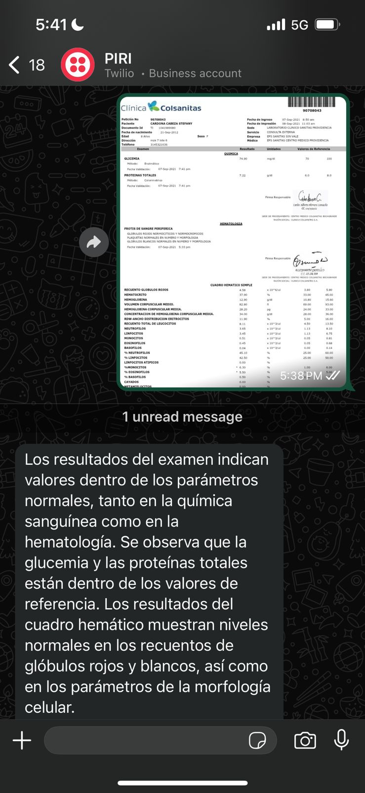

# PIRI: Atención prenatal, apoyo total.

Tu acompañante en la maternidad en WhatsApp y Telegram: pregunta, conversa y monitorea.

<div style="text-align: center;">
  
</div>

## Arquitectura de solución

<div style="text-align: center;">
  
</div>

## Deployment

El despliegue de la aplicación en AWS se realizó utilizando AWS CDK, definiendo la infraestructura como código. Los pasos principales incluyen la inicialización del proyecto, instalación de dependencias, empaquetado de la función Lambda y despliegue en la nube.

Comandos clave:

```shell
cdk init app --language python
./.venv/Scripts/activate
pip install -r requirements.txt
pip install aws-cdk-lib constructs aws-cdk.aws-lambda aws-cdk.aws-apigateway
cd lambda
pip install -r requirements.txt -t .
cd ..
cdk synth
cdk deploy
```

## Demo

<div style="text-align: center;">
  
  
</div>